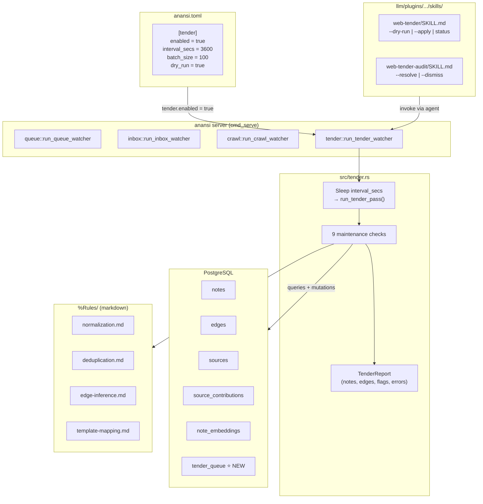
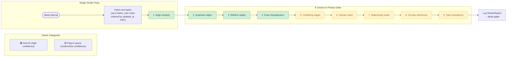
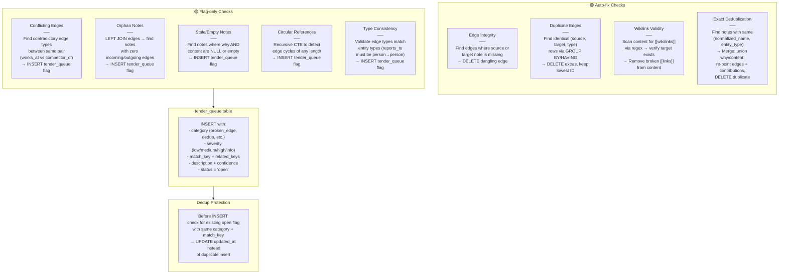
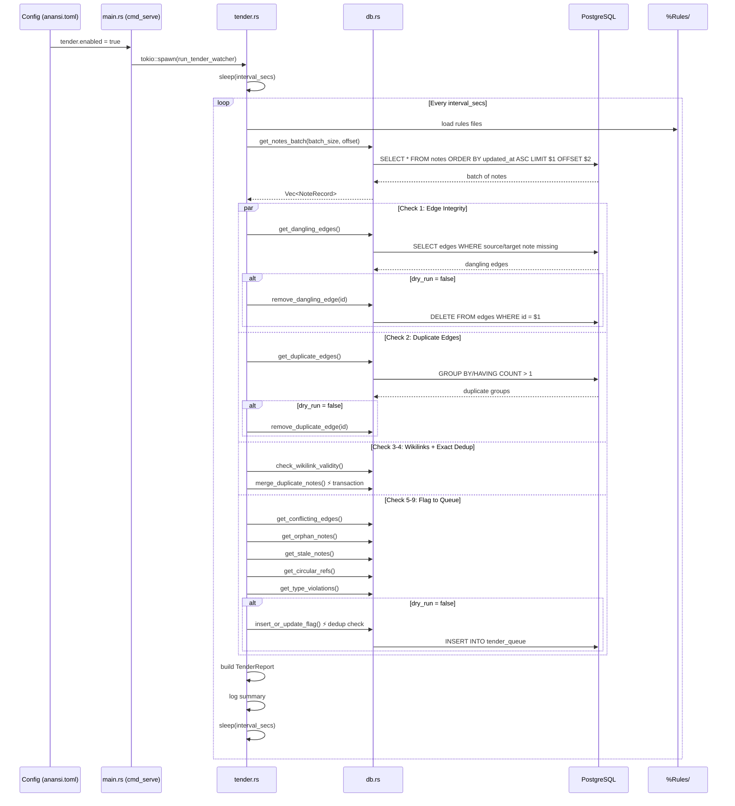
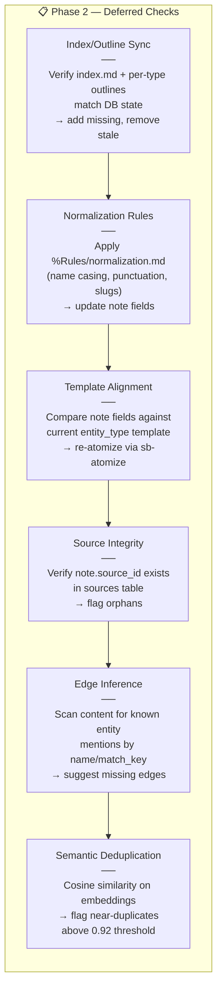

# Web Tender — Architecture Diagrams

## 1. System Architecture

How the Web Tender fits alongside existing watchers, the database, rules files, and skills.

## 2. Check Priority & Flow

The 9 checks in execution order, color-coded by auto-fix vs flag-to-queue.

## 3. Per-Check Behavior

What each check does internally, with transaction and dedup protection.

## 4. Sequence Diagram — Full Tender Pass Lifecycle

The complete flow from config load through batch processing to queue inserts.

## 5. Phase 2 — Deferred Checks

The 6 remaining checks scoped for the next build.

